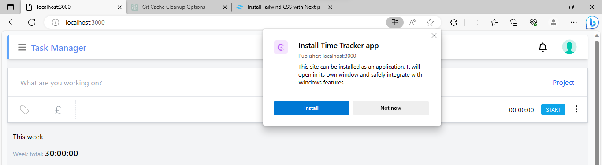

## Clockify Clone mobile app

Clone repo with:
```
git clone https://github.com/Turbosohaib/clockify-clone-mobile-app.git
```

Run:
 ```
 npm install
 ```
 Run app:
 ```
 npm run dev
 ```

 visit: 
 ```
 localhost:3000
 ```

 Install mobile app from the top icon:
 

Or you can see the deployed App:

https://task-manager-mobile-app.vercel.app/


